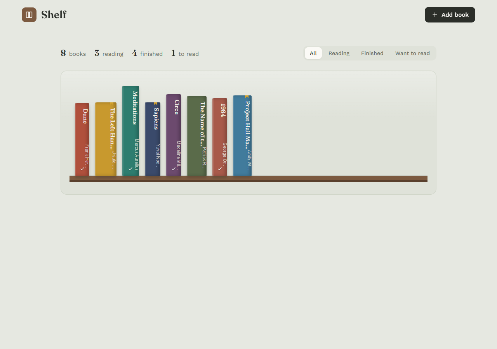

# Shelf

A personal reading tracker. Your books stand as colored spines on a wooden
shelf — add them, move them between *Want to read* / *Reading* / *Finished*,
rate them, and jot a note.

Built with FastAPI + SQLite on the back, plain HTML/CSS/JS on the front, with
hand-drawn SVG icons and no framework.



## Run it (Windows, easiest)

Double-click **`setup.bat`**. The first time it asks where the project folder
is (just press Enter if the file sits inside the project). After that it starts
straight away: it installs everything into a local virtual environment, serves
the app on localhost, and opens your browser at:

```
http://127.0.0.1:8000
```

Keep the window open while you use the app; press `Ctrl+C` to stop the server.

## Run it manually

```bash
python -m venv .venv
.venv\Scripts\python -m pip install -r requirements.txt
.venv\Scripts\python -m uvicorn backend.main:app --reload
```

Then open http://127.0.0.1:8000

## Run the tests

```bash
.venv\Scripts\python -m pytest
```

## Project layout

```
shelf/
  backend/        FastAPI app, SQLite access, Pydantic models
    main.py         API routes + serves the frontend
    database.py     SQLite schema and queries
    models.py       request/response models + validation
  frontend/       the single-page UI
    index.html      structure + custom SVG icon set
    style.css       the shelf, drawer, modal, tokens
    app.js          fetches the API and renders the shelf
  tests/          pytest suite (12 tests)
  requirements.txt
  setup.bat       one-click install + run on localhost
  PLAN.md         full product-lifecycle write-up
```

## API

| Method | Path               | Does                                   |
| ------ | ------------------ | -------------------------------------- |
| GET    | `/api/books`       | List books (optional `?status=`)       |
| GET    | `/api/books/{id}`  | One book                               |
| POST   | `/api/books`       | Add a book                             |
| PATCH  | `/api/books/{id}`  | Change status / rating / notes / title |
| DELETE | `/api/books/{id}`  | Remove a book                          |
